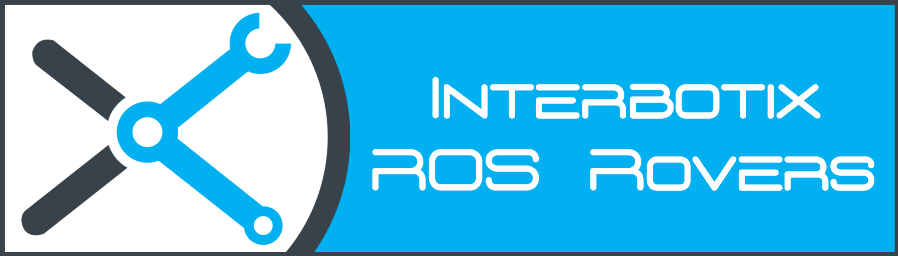
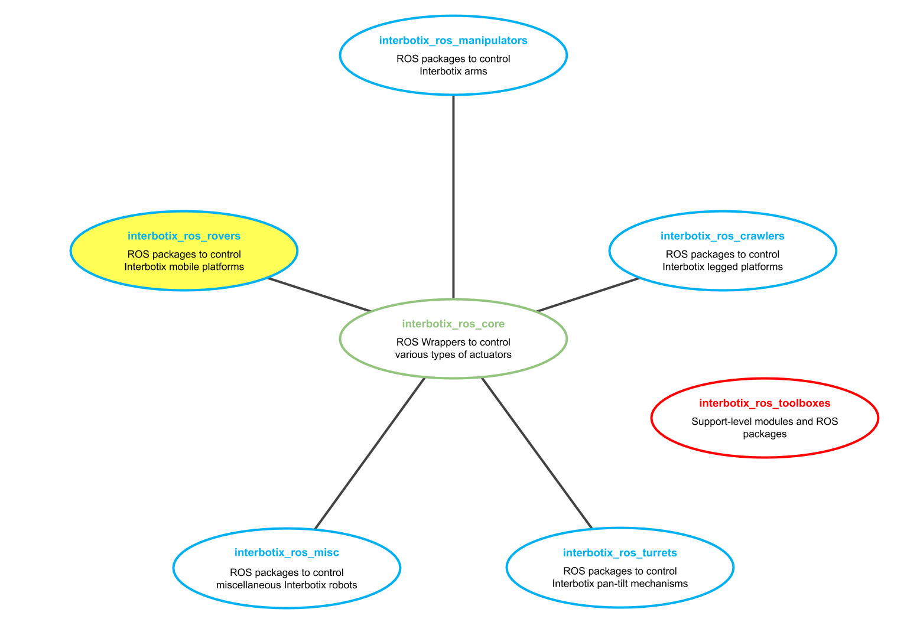

## Overview

Welcome to the *interbotix_ros_rovers* repository! This repo contains custom ROS packages to control the various types of rovers sold at [Trossen Robotics](https://www.trossenrobotics.com/). These ROS packages build upon the ROS driver nodes found in the [interbotix_ros_core](https://github.com/Interbotix/interbotix_ros_core) repository. Support-level software can be found in the [interbotix_ros_toolboxes](https://github.com/Interbotix/interbotix_ros_toolboxes) repository.

## Repo Structure
```
GitHub Landing Page: Explains repository structure and contains a single directory for each type of rover.
├── Rover Type X Landing Page: Contains 'core' rover ROS packages.
│   ├── Core Rover ROS Package 1
│   ├── Core Rover ROS Package 2
│   ├── Core Rover ROS Package X
│   └── Examples: contains 'demo' rover ROS packages that build upon some of the 'core' rover ROS packages
│       ├── Demo Rover ROS Package 1
│       ├── Demo Rover ROS Package 2
│       ├── Demo Rover ROS Package X
│       └── Python Scripts: contains 'demo' Python scripts that build upon modules in the interbotix_ros_toolboxes repository
│           ├── Demo Python Script 1
│           ├── Demo Python Script 2
|           └── Demo Python Script X
├── LICENSE
└── README.md
```

As shown above, there are five main levels to this repository. To clarify some of the terms above, refer to the descriptions below.

- **Rover Type** - Any rover that can use the same *interbotix_XXXXX_control* package is considered to be of the same type. For the most part, this division lies on the type of actuator that makes up the robot. As an example, all the X-Series LoCoBots are considered the same type of rover since they all use various Dynamixel X-Series servos (despite the fact that they come in different sizes, DOF, and motor versions). However, a rover made up of some other manufacturer's servos, or even half made up of Dynamixel servos and half made up of some other manufacturer's servos would be considered a different rover type.

- **Core Rover ROS Package** - This refers to 'High Profile' ROS packages that are essential to make a given rover work. Examples of 'High Profile' ROS packages include:
    - *interbotix_XXXXX_control* - sets up the proper configurations and makes it possible to control the physical rover
    - *interbotix_XXXXX_moveit* - sets up the proper configurations and makes it possible to control an arm on a rover via MoveIt
    - *interbotix_XXXXX_gazebo* - sets up the proper configurations and makes it possible to control a Gazebo simulated rover
    - *interbotix_XXXXX_ros_control*  - ROS control package used with MoveIt to control the physical arm on a rover
    - *interbotix_XXXXX_descriptions* - contains URDFs and meshes of the rovers, making it possible to visualize them in RViz

- **Demo Rover ROS Package** - This refers to demo ROS packages that build upon the **Core Rover ROS Packages**. ROS researchers could use these packages as references to learn how to develop their own ROS packages and to get a feel for how the robot works. Typical demos for a given rover type include:
    - *interbotix_XXXXX_joy* - manipulate an arm's end-effector or move the mobile base using a joystick controller
    - *interbotix_XXXXX_moveit_interface* - learn how to use MoveIt!'s MoveGroup Python or C++ APIs to control an arm on the rover

- **Demo Python Script** - This refers to demo Python scripts that build upon modules in the *interbotix_ros_toolboxes* repository. These modules essentially abstract away all ROS code, making it easy for a researcher with no ROS experience to interface with a rover as if it was just another Python object. It also makes sequencing robot motion a piece of cake.

Over time, the repo will grow to include more types of rovers.

## Contributing
Feel free to send PRs to add features to currently existing Rover ROS packages or to include new ones. Note that all PRs should follow the structure and naming conventions outlined in the repo including documentation.

## Contributors
- [Solomon Wiznitzer](https://github.com/swiz23) - **ROS Engineer**
- [Luke Schmitt](https://github.com/lsinterbotix) - **Robotics Software Engineer**
- [Levi Todes](https://github.com/LeTo37) - **CAD Engineer**
