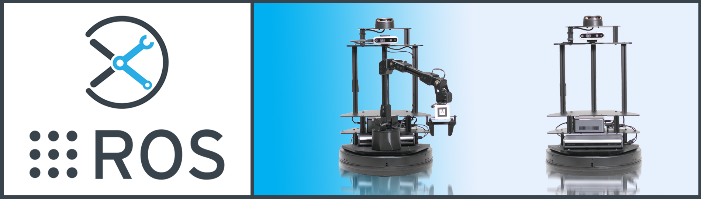
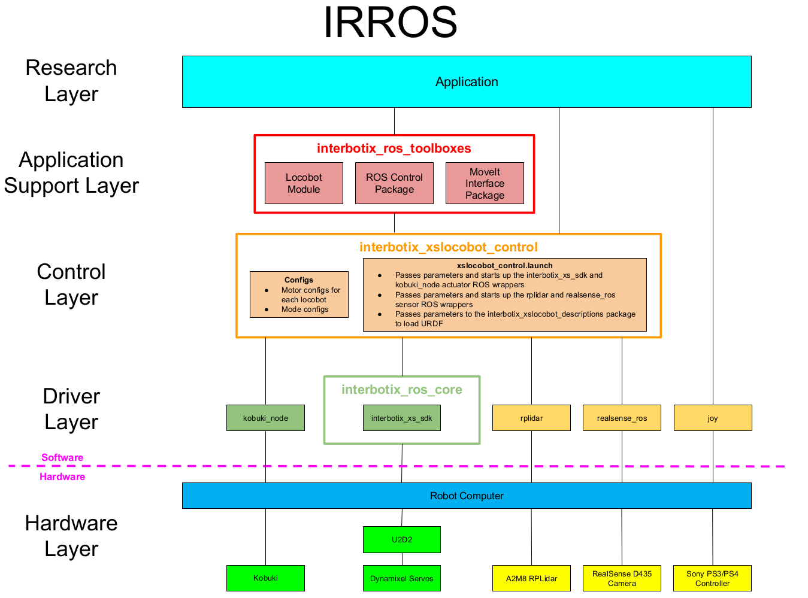

# InterbotiX X-Series LoCoBot ROS Packages

## Overview

Welcome to the *interbotix_ros_xslocobots* sub-repo! This sub-repository contains ROS packages meant to be used with the various Locobot Rovers sold by Trossen Robotics. Packages were tested on Ubuntu Linux 18.04 and 20.04 using ROS Melodic and Noetic respectively. Additionally, all ROS nodes were written using Python or C++. However, any programming language capable of sending ROS messages can be used to control the robots. To that effect, the core packages inside this repo are as follows:
- **interbotix_xslocobot_nav** - contains the config and launch files necessary to run the Nav Stack on the LoCoBot
- **interbotix_xslocobot_perception** - contains the config and launch files necessary to run the Perception Pipeline on the LoCoBot
- **interbotix_xslocobot_moveit** - contains the config files necessary to launch an arm (on the LoCoBot) using MoveIt either in Gazebo, on the physical robot, or just in RViz
- **interbotix_xslocobot_gazebo** - contains the config files necessary to launch a LoCoBot in Gazebo, including tuned PID gains for ros_control
- **interbotix_xslocobot_control** - contains the motor configuration files and the 'root' launch file that is responsible for launching the LoCoBot
- **interbotix_xslocobot_ros_control** - contains the config files necessary to setup ROS controllers between MoveIt and the physical robot arm that's on the LoCoBot
- **interbotix_xslocobot_descriptions** - contains the meshes and URDFs (including accurate inertial models for the links) for all LoCoBot platforms

Finally, there is also an **examples** directory containing various demos of how the above mentioned core packages can be used. So what are you waiting for? Let's get started!

## IRROS Structure
Refer [here](https://github.com/Interbotix/interbotix_ros_core#code-structure) to get a general understanding of IRROS.

##### Hardware Layer
All LoCoBots contain arms and pan/tilt mechanisms made up of [X-Series DYNAMIXEL servos](https://www.trossenrobotics.com/robot-servos). Each servo has two 3-pin JST ports that allows it to be daisy chained with other servos using 3-pin cables. The 'root' DYNAMIXELs (i.e. the 'waist' and 'pan' motors) then connect to the [XM/XL motor power hub](https://www.trossenrobotics.com/3-pin-x-series-power-hub.aspx). Besides for providing 12V to the motors from the barrel jack, the hub also connects to the 3-pin JST port on the [U2D2](https://www.trossenrobotics.com/dynamixel-u2d2.aspx). This device acts as a communication interface between a computer (connected via microUSB cable) and the motors - converting USB/TTL signals back and forth.

Besides for the DYNAMIXEL servo, there is another type of actuator present on the LoCoBot that drives the Kobuki base. This is shown on the bottom left of the diagram above. Two of these actuators exist to drive the two wheels on the base.

On the right side of this layer, there are three sensors. All LoCoBots come with the [RealSense D435 camera](https://www.intelrealsense.com/depth-camera-d435/) used to perform depth and color sensing. Additionally, there is the [A2M8 RPLidar](https://www.slamtec.com/en/Lidar/A2) navigation scanner which can be added on if desired. Finally, a joystick controller can be used to control the robot.

##### Driver Layer
The ROS packages in this sub-repo build up from the *interbotix_xs_sdk* ROS wrapper found in the *interbotix_ros_core* repository. Reference the package there for implementation details. The *realsense_ros* and *joy* packages are ROS wrappers around the RealSense camera and PS3/PS4 controller devices respectively. Similarly, the *rplidar* package is a a ROS Wrapper around the 360 degree laser scanner.

##### Control Layer
The *interbotix_xslocobot_control* ROS package found in this layer holds the config files for every one of our X-Series LoCoBots. These config files define the names of the joints that make up each arm and pant/tilt mechanism as well as initial values for the motor registers. The launch file inside the package then passes the appropriate parameters to the *interbotix_xs_sdk* driver node depending on the type of LoCoBot being used.

##### Application Support Layer
The three main items shown in this layer can be found in the *interbotix_ros_toolboxes* repository [here](https://github.com/Interbotix/interbotix_ros_toolboxes/tree/main/interbotix_xs_toolbox). Specifically, the LoCoBot module can be found within the *interbotix_xs_modules* ROS package in a file called 'locobot.py'. It essentially provides a small API to allow users to control any of the LoCoBot's actuators in Python - no ROS experience necessary. Additionally, the *interbotix_xs_ros_control* and *interbotix_moveit_interface* packages make it possible for the *interbotix_xslocobot_ros_control* and *interbotix_xslocobot_moveit_interface* packages respectively to function properly.

##### Research Layer
All the ROS packages and Python scripts found within the [examples](examples/) directory fall in this category.

## Documentation

Find all documentation related to the X-Series LoCoBots including specifications, hardware setup, ROS packages, troubleshooting, and more at the [Trossen Robotics X-Series LoCoBot Documentation site](https://www.trossenrobotics.com/docs/interbotix_xslocobots/index.html).

Look for the  button on package and example READMEs for their structure and usage information.

## Contributing
To contribute your own custom X-Series LoCoBot in this repo, you will need to do the following steps:
- Create a motor config file similar to the YAML files found [here](interbotix_xslocobot_control/config/) (excluding the 'modes.yaml' file). To get familiar with the parameter names, checkout the [Motor Config Template](https://github.com/Interbotix/interbotix_ros_core/blob/main/interbotix_ros_xseries/interbotix_xs_sdk/config/motor_configs_template.yaml). Note that the name of this file is what defines your *robot_model* name, and should be used when naming other files like the URDF.
- Create a URDF similar in structure to the ones found [here](interbotix_xslocobot_descriptions/urdf/). Don't forget to put all necessary meshes in the [meshes](interbotix_xslocobot_descriptions/meshes/) directory! As an FYI, you should follow the naming convention for the links, joints, and frame poses as found in the other arm files for consistency.
- Create a set of Gazebo/ROS position controllers similar to the ones found [here](interbotix_xslocobot_gazebo/config/position_controllers/).
- Create a set of Gazebo/ROS trajectory controllers similar to the ones found [here](interbotix_xslocobot_gazebo/config/trajectory_controllers/).
- Create an SRDF file for Moveit similar to the ones found [here](interbotix_xslocobot_moveit/config/srdf/). You should first use the MoveIt Setup Assistant Wizard for this step and then edit the generated SRDF file based on the structure of those files.
- If you are integrating your own DYNAMIXEL-based custom designed arm (not one of the Interbotix models), add the appropriate Screw axes and M matrices to the [mr_descriptions](https://github.com/Interbotix/interbotix_ros_toolboxes/blob/main/interbotix_xs_toolbox/interbotix_xs_modules/src/interbotix_xs_modules/mr_descriptions.py) module (syntax should be something like *mobile_XXXXX*). For help doing this, refer to Chapter 4 in [Modern Robotics](http://hades.mech.northwestern.edu/images/7/7f/MR.pdf) and [this video](https://www.youtube.com/watch?v=cKHsil0V6Qk&ab_channel=NorthwesternRobotics), or check out our [kinematics_from_description](https://github.com/Interbotix/kinematics_from_description) tool.
- Make sure to follow the same naming convention, structure, and documentation procedures as found in the repo before making a PR.

## Contributors
- [Solomon Wiznitzer](https://github.com/swiz23) - **ROS Engineer**
- [Luke Schmitt](https://github.com/lsinterbotix) - **Robotics Software Engineer**
- [Levi Todes](https://github.com/LeTo37) - **CAD Engineer**
