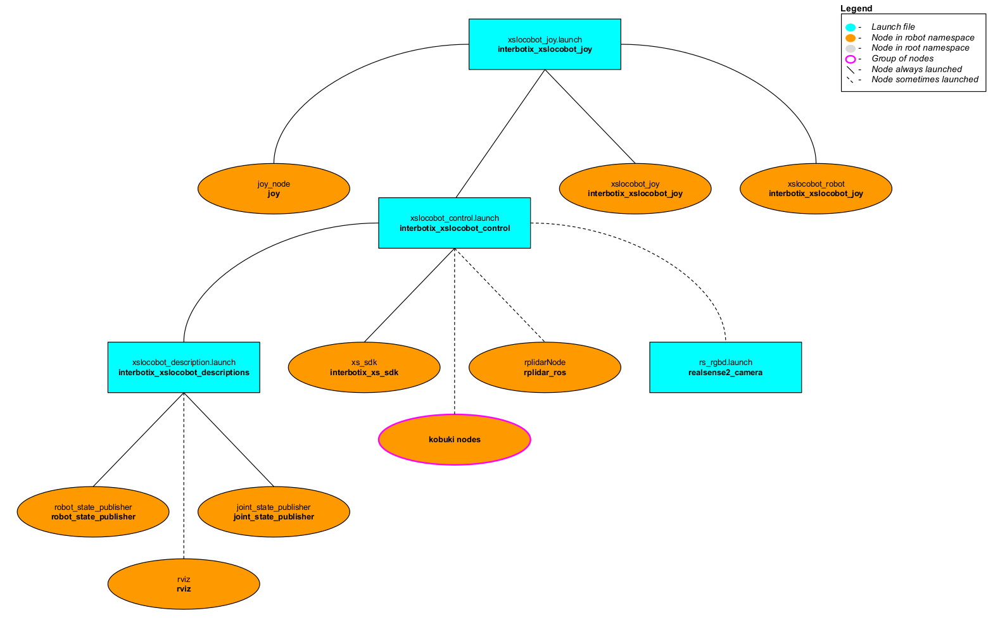

# interbotix_xslocobot_joy

## Overview
This package can be used to control the movements of any rover in the Interbotix X-Series Locobot Family using a SONY PS3 or PS4 controller via Bluetooth. In this demo, the 'arm' (if equipped) and 'pan/tilt' servos work in 'position' control mode, the gripper operates in 'PWM' mode, and the Kobuki base operates in 'velocity' control mode. Refer to the joystick button map below to see how to operate the robot. Specifically, some of the joystick controls manipulate individual joints while others are used to perform 'inverse kinematics' on all the joints to get the end-effector of the robot (defined at 'ee_gripper_link') to move as if it's in Cartesian space. This is done using the [modern_robotics](https://github.com/NxRLab/ModernRobotics/tree/master/packages/Python) code library offered by Northwestern University.

## Structure

As shown above, the *interbotix_xslocobot_joy* package builds on top of the *interbotix_xslocobot_control* package. To get familiar with the nodes in the *interbotix_xslocobot_control* package, please look at its README. The other nodes are described below:
- **joy** - a ROS driver for a generic Linux joystick; it reads data from a SONY PS3 or PS4 controller joystick over Bluetooth and publishes  [sensor_msgs/Joy](http://docs.ros.org/melodic/api/sensor_msgs/html/msg/Joy.html) messages to the `/<robot_name>/commands/joy_raw` topic
- **xslocobot_joy** - responsible for reading in raw [sensor_msgs/Joy](http://docs.ros.org/melodic/api/sensor_msgs/html/msg/Joy.html) messages from the `/<robot_name>/commands/joy_raw` topic and converting them into [interbotix_xs_msgs/LocobotJoy](https://github.com/Interbotix/interbotix_ros_core/tree/main/interbotix_ros_xseries/interbotix_xs_msgs/msg/LocobotJoy.msg) messages; this makes the code more readable and allows users to remap buttons very easily later. The new messages are then published on the `/<robot_name>/commands/joy_processed` topic.
- **xslocobot_robot** - responsible for reading in [interbotix_xs_msgs/LocobotJoy](https://github.com/Interbotix/interbotix_ros_core/tree/main/interbotix_ros_xseries/interbotix_xs_msgs/msg/LocobotJoy.msg) messages from the `/<robot_name>/commands/joy_processed` topic and publishing joint, gripper, and pan/tilt commands to the **xs_sdk** node; while the 'waist' joint is directly controlled via the PS3/PS4 joystick, other buttons allow position-ik to be performed using all the arm joints. It also publishes velocity commands to the Kobuki base.

## Bluetooth Setup
#### Sony PS4 Controller (Recommended)
Getting a PS4 controller connected via Bluetooth to a Linux laptop is pretty straightforward. Click the *Bluetooth* icon on the top right of your screen, followed by *Bluetooth Settings...*. Next, press and hold the *Share* button on the PS4 controller (see image below for reference). While holding the *Share* button, press and hold the *PS* button. After a few seconds, the triangular shaped LED located between the *L2* and *R2* buttons should start rapidly flashing white (about twice a second) at which point you can let go.

On the computer, click the '+' icon in the *Bluetooth* settings window. Wait until you see 'Wireless Controller' pop up, select it, and click *Next* on the bottom right of the window. A message should display saying 'successfully set up new device 'Wireless Controller'' and the LED should turn blue. This means the controller is connected to the computer. To disconnect, hold down the *PS* button for about 10 seconds until the LED turns off. To reconnect, just press the *PS* button (no need to hold it down). After blinking white a few times, the LED should turn blue.


##### Sony PS3 Controller
Getting a PS3 controller connected via Bluetooth to a Linux laptop can be a bit finicky at times. However, the commands below should do the trick. Get an original SONY PS3 controller, it's accompanying USB cable, and open up a terminal. Type:
```
$ sudo bluetoothctl
[bluetooth]# power on
[bluetooth]# agent on
[bluetooth]# scan on
```
Now, plug the PS3 controller into the Linux Laptop. At this point, a message should pop up in the terminal that looks something like the following (with a different MAC address):
```
[NEW] Device FC:62:B9:3F:79:E7 PLAYSTATION(R)3 Controller
```
When it appears, type:
```
[bluetooth]# trust <MAC-address>
```
Now unplug the PS3 controller and press the PS button. The four red LEDs at the front of the controller should flash a few times, eventually leaving just one LED on by the '1'. This means that the joystick paired successfully.

Sometimes, the joystick might cause the cursor of the computer mouse to go crazy. To fix this, add the following line to the `.bashrc` file:
```
alias joy_stop='xinput set-prop "PLAYSTATION(R)3 Controller" "Device Enabled" 0'
```
Now, whenver the PS3 joystick is paired to the computer, just type `joy_stop` in the terminal to stop it messing with the mouse (you're welcome).

## Usage
After pairing the joystick, type the following in a terminal (let's say to control the **locobot_wx200** robot with no lidar):
```
roslaunch interbotix_xslocobot_joy xslocobot_joy.launch robot_model:=locobot_wx200
```
A red error message might appear in the screen saying `Couldn't open joystick force feedback!`. This is normal and will not affect the joystick operation. To further customize the launch file at run-time, look at the table below:

| Argument | Description | Default Value |
| -------- | ----------- | :-----------: |
| robot_model | model type of the Interbotix Locobot such as 'locobot_base' or 'locobot_wx250s' | "" |
| robot_name | name of the robot (could be anything but defaults to 'locobot') | "locobot" |
| use_rviz | launches Rviz; if you are SSH'd into the robot, DON'T set this to true | false |
| rviz_frame | fixed frame in Rviz; this should be changed to `map` or `<robot_name>/odom` if mapping or using local odometry respectively | $(arg robot_name)/odom |
| use_base | if true, the Kobuki ROS nodes are launched | true |
| use_lidar | if true, the RPLidar node is launched | false |
| show_lidar | set to true if the lidar is installed on the robot; this will load the lidar related links to the 'robot_description' parameter | $(arg use_lidar) |
| use_camera | if true, the RealSense D435 camera nodes are launched | false |
| threshold | value from 0 to 1 defining joystick sensitivity; a larger number means the joystick should be less sensitive | 0.75 |
| controller | type of PlayStation controller ('ps3' or 'ps4') | ps4 |
| mode_configs | the file path to the 'mode config' YAML file | refer to [xslocobot_joy.launch](launch/xslocobot_joy.launch) |
| use_sim | if true, the Dynamixel simulator node is run; use Rviz to visualize the robot's motion; if false, the real Dynamixel driver node is run | false |

To understand how the joystick buttons map to controlling the robot, look at the diagram and table below:


#### Base Control Mode
| Button | Action |
| ------ | ------ |
| Left stick Up/Down | drive the Kobuki base forward/backward between 0.7 to -0.7 m/s |
| R2 | rotate the Kobuki base clockwise between 0 and -3.14 rad/s |
| L2 | rotate the Kobuki base counterclockwise between 0 and 3.14 rad/s |
| SELECT/SHARE | Reset the odometry of the base to an 'x', 'y', and 'theta' of 0 (the base chirps as well)|
| Right stick Up/Down | tilt the RealSense camera Up/Down |
| Right stick Left/Right | pan the RealSense camera Left/Right |
| START/OPTIONS | move the pan/tilt servo to '0' radians |

#### Arm Control Mode
| Button | Action |
| ------ | ------ |
| START/OPTIONS | move robot arm to its Home pose |
| SELECT/SHARE | move robot arm to its Sleep pose |
| R2 | rotate the 'waist' joint clockwise |
| L2 | rotate the 'waist' joint counterclockwise |
| Triangle | increase gripper pressure in 0.125 step increments (max is 1)|
| X | decrease gripper pressure in 0.125 step increments (min is 0)|
| O | open gripper |
| Square | close gripper |
| Right stick Up/Down | increase/decrease pitch of the end-effector |
| Right stick Left/Right | increase/decrease roll of the end-effector |
| R3 | reverses the Right stick Left/Right control |
| Left stick Up/Down | move the end-effector (defined at 'ee_gripper_link') vertically in Cartesian space |
| Left stick Left/Right | move the end-effector (defined at 'ee_gripper_link') horizontally in Cartesian space |
| L3 | reverses the Left stick Left/Right control |
| R1 | if the arm has 6dof, this moves the end-effector in a negative direction along its own 'y' axis |
| L1 | if the arm has 6dof, this moves the end-effector in a positive direction along its own 'y' axis |

#### Both Modes
| Button | Action |
| ------ | ------ |
| D-pad Up | increase the control loop rate in 1 Hz step increments (max of 40) |
| D-pad Down | decrease the control loop rate in 1 Hz step increments (min of 10) |
| D-pad Left | 'coarse' control - sets the control loop rate to a user-preset 'fast' rate |
| D-pad Right | 'fine' control - sets the control loop rate to a user-preset 'slow' rate |
| PS | shift to the other Control Mode |
