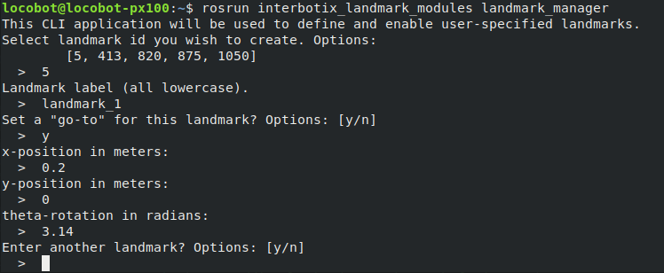
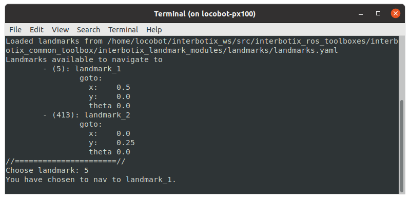

# interbotix_xslocobot_landmark_nav

## Overview
This package builds on top of the *interbotix_xslocobot_nav*, *interbotix_landmark_modules*, and *interbotix_perception_modules* packages to provide a method to traverse the map towards points of interest (landmarks) marked by AprilTags.

## Structure
<!--  -->

As mentioned before, this package builds on the *interbotix_landmark_modules* package. A short description of the nodes needed from that package can be found below:
 - **tf_map_to_landmark** - very small node that publishes an identity transform between the map frame and the landmark frame, separating the landmarks from the rest of the tf tree
 - **landmark_finder** - uses the AprilTag single image detector service to search for tags and publish their location in the map during mapping
 - **landmark_manager** - tool to create landmarks from the set of valid AprilTags

Other packages required for landmark_nav include *move_base* and *interbotix_perception_modules*:
 - **move_base** - performs path planning to the selected landmark goal and will attempt to reach said goal by sending velocity commands to the kobuki base
 - **static_transform_pub** - publishes any transform it receives to the static transform tree; used to build a tf tree that describes landmark poses relative to the map

A more in-depth description of the nodes used by the *interbotix_xslocobot_nav* package can be found in its Structure section.

## Usage
There are three steps to using this package. First, landmarks must be created using the **landmark_manager** tool. Next, the robot maps out the area using SLAM techniques and locates the landmark tags in the map. Finally, the robot navigates to a selected landmark.

#### Adding Landmarks
To start using this package, you must first create a set of landmarks. You can either edit the [landmarks.yaml](landmarks/landmarks.yaml) configuration file, or you can use the **landmark_manager** tool. To access this tool, run the following command on the robot computer:

```bash
$ roslaunch interbotix_xslocobot_landmark_nav landmark_manager.launch
```

<p align="center">
    
</p>

The tool presents a command line application to manage landmarks. From the set of valid tag ids, you can choose any of them to label and set a *mounted_offset*. The *mounted_offset* is the distance away from the wall that the robot should navigate to if a tag is mounted to it.
<!-- A diagram describing this convention is below:

<p align="center">
    
</p> -->

Note that tags with an assigned landmark are in parentheses. Launch options for the **landmark_manager** tool in the [landmark modules package README](https://github.com/Interbotix/interbotix_ros_toolboxes/tree/main/interbotix_common_toolbox/interbotix_landmark_modules#landmark_managerlaunch).

#### Mapping
Once a valid set of landmarks is created, you can now map out the robot's environment. To start the SLAM process from a fresh map, type the following in a terminal on the robot computer:
```bash
$ roslaunch interbotix_xslocobot_landmark_nav xslocobot_landmark_nav.launch robot_model:=locobot_px100 mapping:=true rtabmap_args:=-d
```

To save the location of the landmark, the robot must 'see' its tag. To ensure that the tag is in view, check the terminal for a line like:
```
[INFO] Static Transform Publisher received TF from "landmarks" to "landmark_2"
```
This line means that the **landmark_finder** node saw the landmark, calculated its pose relative to the map frame, and published it to the **static_transform_pub** where it was added to the static tf tree.

Once all landmarks have been found, you can shut down ROS using Ctrl + C. The landmarks and their positions in the map will be saved.

A more in-depth review of the general mapping process can be found in the *interbotix_xslocobot_nav* package's SLAM From Scratch section.

#### Localization
Now that all the tags have been located and the map has been explored, you are now ready to navigate to any landmark. To start the localization process, type the following in a terminal on the robot computer:
```bash
$ roslaunch interbotix_xslocobot_landmark_nav xslocobot_landmark_nav.launch robot_model:=locobot_px100 localization:=true
```

This will launch the navigation stack, as well as a command line application in a new terminal. This application simply displays the active landmarks and asks you to choose one to navigate to.

<p align="center">
    
</p>

Once selected, the application will send a pose goal to the move_base node where it will then drive the robot to the location.

<!-- ## Troubleshooting Notes
TODO -->
