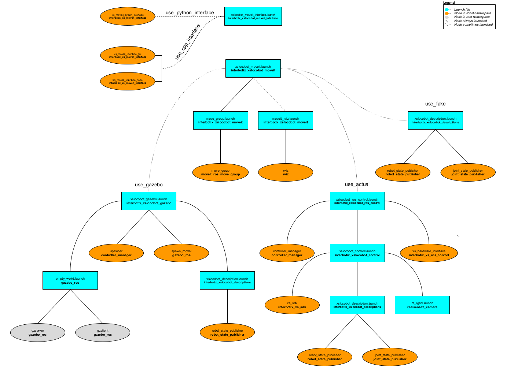

# interbotix_xslocobot_moveit_interface

## Overview
This package contains a small API modeled after the [Move Group C++ Interface Tutorial](https://github.com/ros-planning/moveit_tutorials/blob/kinetic-devel/doc/move_group_interface/src/move_group_interface_tutorial.cpp) that allows a user to command desired end-effector poses to an arm on an Interbotix X-Series Locobot. It is not meant to be all-encompassing but rather should be viewed as a starting point for someone interested in creating their own MoveIt interface to interact with an arm. With it comes a small GUI that can be used to pose the end-effector.

Finally, this package also contains a modified version of the [Move Group Python Interface Tutorial](https://github.com/ros-planning/moveit_tutorials/blob/kinetic-devel/doc/move_group_python_interface/scripts/move_group_python_interface_tutorial.py) script that can be used as a guide for those users who would like to interface with an Interbotix robot via the MoveIt Commander Python module.

## Structure

As shown above, this package builds on top of both the *interbotix_xslocobot_gazebo* and *interbotix_xslocobot_control* packages. To get familiar with those packages, please refer to their respective READMEs. The *interbotix_xslocobot_moveit_interface* nodes are described below:
- **moveit_interface** - a small C++ API that makes it easier for a user to command custom poses to the end-effector of an Interbotix arm; it uses MoveIt's planner behind the scenes to generate desired joint trajectories
- **moveit_interface_gui** - a GUI (modeled after the one in the *joint_state_publisher* package) that allows a user to enter in desired end-effector poses via text fields or sliders; it uses the **moveit_interface** API to plan and execute trajectories
- **moveit_python_interface** - a modified version of the script used in the [Move Group Python Interface](http://docs.ros.org/kinetic/api/moveit_tutorials/html/doc/move_group_python_interface/move_group_python_interface_tutorial.html) tutorial that is meant to work with an Interbotix arm; just press 'Enter' in the terminal to walk through the different steps; the desired joint state goal, pose goal, and end-effector offset (when attaching the box) are stored in YAML files located in the [config](config/) directory

## Usage
To run this package on the physical robot using the small C++ API & GUI, type the line below in a terminal (assuming the **locobot_wx200** with lidar is being launched).
```
$ roslaunch interbotix_xslocobot_moveit_interface xslocobot_moveit_interface.launch robot_model:=locobot_wx200 show_lidar:=true use_actual:=true use_cpp_interface:=true
```
A GUI should pop-up similar to the one below. In it, a user should specify the desired position and orientation of the end-effector (as defined by the 'ee_gripper_link' w.r.t. the 'base_footprint' frame). This can be done either via the slider bars or by entering values into the text fields. Next, a user can press one of five buttons. They are:
- **Plan Pose** - MoveIt will attempt to find a trajectory that places the end-effector at the desired position and orientation
- **Plan Position** - MoveIt will attempt to find a trajectory that places the end-effector at the desired position, ignoring orientation
- **Plan Orientation** - MoveIt will attempt to find a trajectory that places the end-effector at the desired orientation, ignoring position; note that the planner fails more often than not for this option
- **Execute** - Once a valid plan has been found, this button can be pressed to actually execute the trajectory on the robot
- **Reset** - This resets all slider bars to the middle and text fields to '0.00'

Note that occasionally, MoveIt will be unsuccessful in finding a valid trajectory. This could be for one of two reasons. Either the desired pose is not physically attainable by the arm or the random seed generated by MoveIt was a bad guess. If it is clear that the pose is physically attainable, try hitting the desired 'Plan' button a few more times.

<p align="center">
  
</p>

To run this package on the physical robot using the python interface, type the line below in a terminal (assuming the **locobot_wx250s** with no lidar is being launched).
```
$ roslaunch interbotix_xslocobot_moveit_interface xslocobot_moveit_interface.launch robot_model:=locobot_wx250s use_actual:=true dof:=6 use_python_interface:=true
```
After MoveIt finishes loading, press 'Enter' in the terminal to step through the tutorial.

This is the bare minimum needed to get up and running. Take a look at the table below to see how to further customize with other launch file arguments.

| Argument | Description | Default Value |
| -------- | ----------- | :-----------: |
| robot_model | model type of the Interbotix Locobot such as 'locobot_base' or 'locobot_wx250s' | "" |
| robot_name | name of the robot (could be anything but defaults to 'locobot') | "locobot" |
| show_lidar | set to 'true' if the lidar is installed on the robot; this will load the lidar related links to the 'robot_description' parameter for collision purposes;  | false |
| external_urdf_loc | the file path to the custom urdf.xacro file that you would like to include in the Interbotix robot's urdf.xacro file| "" |
| external_srdf_loc | the file path to the custom srdf.xacro file that you would like to include in the Interbotix robot's srdf.xacro file. Note that this should only contain 'disable collision' tags for collisions between the original Interbotix Arm and other links that are defined in the file specified by `external_urdf_loc` | "" |
| mode_configs | the file path to the 'mode config' YAML file | refer to [xslocobot_moveit_interface.launch](launch/xslocobot_moveit_interface.launch) |
| use_gazebo | launch MoveIt with a Gazebo simulated robot | false |
| use_actual | launch MoveIt with the physical robot | false |
| use_fake | launch MoveIt with a MoveIt generated fake robot | false |
| dof | the degrees of freedom of the arm | 5 |
| use_camera | if true, the RealSense D435 camera nodes are launched; note that the main idea behind this is to generate an Occupancy Map for MoveIt to use when collision checking; however, this feature is not fully implemented yet | false |
| use_moveit_rviz | set to false if you would like to use MoveIt in a headless state; otherwise, set to true to display Rviz with the MoveIt plugin | true |
| world_name | the file path to the Gazebo 'world' file to load (if simulating) | refer to [xslocobot_moveit_interface.launch](launch/xslocobot_moveit_interface.launch) |
| use_cpp_interface | launch the custom C++ API node | false |
| moveit_interface_gui | launch a custom GUI to interface with the **moveit_interface** node so that you can command specific end-effector poses (defined by 'ee_gripper_link') | true |
| use_python_interface | launch the Python Interface Tutorial node | false |
