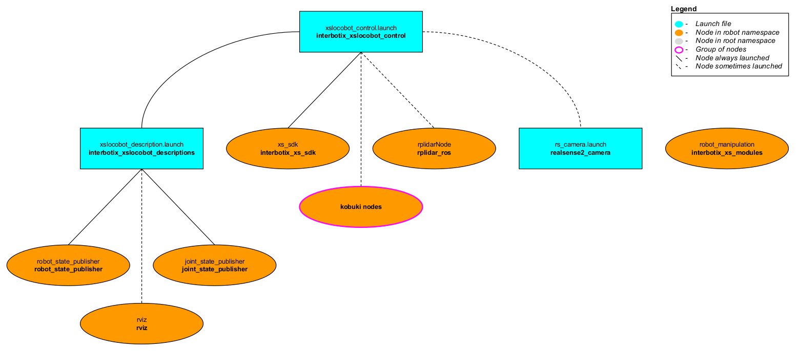
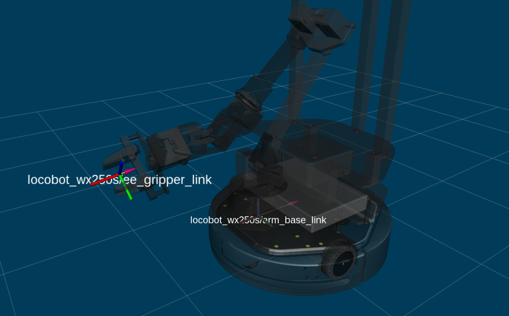

# Interbotix X-Series Locobot Python API Demos

## Overview
This directory showcases various ways of using the [Interbotix Python Locobot Module](https://github.com/Interbotix/interbotix_ros_toolboxes/blob/main/interbotix_xs_toolbox/interbotix_xs_modules/src/interbotix_xs_modules/locobot.py) (click the link to see the fully documented code). Simply put, this API was created so that users with little to no ROS experience would still have the ability to control any Interbotix Locobot supported by the *interbotix_xs_sdk*. Specifically, the API also allows a user to make an arm go to desired end-effector poses or follow Cartesian trajectories. This last feature was made possible by the [Modern Robotics: Mechanics, Planning, and Control Code Library](https://github.com/NxRLab/ModernRobotics) created at Northwestern University. It also allows the ability to move the camera pan/tilt servos and send velocity commands to the base.

For the API to work, the arm and pan/tilt joints must be set to 'position' control and the gripper set to 'PWM' control (conveniently, these are the default configs in the *interbotix_xslocobot_control* package). Furthermore, the API assumes that all the arm-joint motors' [Drive Mode](http://emanual.robotis.com/docs/en/dxl/x/xm430-w350/#drive-mode) registers are set to [Time-Based-Profile](http://emanual.robotis.com/docs/en/dxl/x/xm430-w350/#profile-velocity112) (this is also the default configuration). In a nutshell, this setting makes it very easy for you as the user to customize the duration and smoothness of an arm's motion from one pose to the next.

## Structure


The Python Locobot module (located in the *interbotix_xs_modules* ROS package) builds on top of the *interbotix_xs_sdk* package. To get familiar with the other nodes in the graph above, look at the various packages READMEs.
- **robot_manipulation** - a ROS node (operating 'behind the scenes') that takes in commands entered via the Python API and publishes data to various ROS topics as necessary. It is not a classic ROS node in the sense that it can't be launched from a ROS launch file or run from the terminal using a `rosrun` command. Rather, the Python API module contains a Class that when instantiated, gives the node life. At the completion of a program, the object gets destroyed, killing the node.

## Terminology
<p align="center">
  
</p>

Before getting started with the Python API, it is important to understand some terminology. First off, end-effector poses are specified from */<robot_name>/ee_gripper_link* (a.k.a the 'Body' frame) to */<robot_name>/arm_base_link* (a.k.a the 'Space' frame). In the code documentation, this transform is knows as **T_sb** (i.e. the transform that specifies the 'Body' frame 'b' in terms of the 'Space' frame 's'). It goes without saying that the 'red' axis is the 'X-frame', the 'green' axis is the 'Y-frame', and the 'blue' axis is the 'Z-frame'. The way this information is stored is via a transformation matrix as shown below.

<p align="center">
  
</p>

In the image above, the first three rows and three columns define a 3-dimensional rotation matrix that describes the orientation of the 'Body' frame with respect to the 'Space' frame. On the other hand, the first three rows and the fourth column of the matrix represent the translational position (i.e. xyz) of the 'Body' frame with respect to the 'Space' frame. Finally, the fourth row of the matrix is always [0 0 0 1] for matrix multiplication purposes. Besides for seeing **T_sb** in the code documentation, you will also see **T_sd**. The main difference between these two transforms is that **T_sb** defines the current end-effector pose whereas **T_sd** defines the desired ('d') end-effector pose with respect to the 'Space' frame. If using the `set_ee_pose_matrix` function, **T_sd** is what you should be specifying.

Some of us though prefer not to think in terms of transformation or rotation matrices. That's where the `set_ee_pose_components` function comes in handy. In this function, you define **T_sd** in terms of the components it represents - specifically the x, y, z, roll, pitch, and yaw of the 'Body' frame with respect to the 'Space' frame (where x, y, and z are in meters, and roll, pitch and yaw are in radians). If using an arm with less than 6dof, the 'yaw' parameter, even if specified, will always be ignored.

As an FYI, if you set two end-effector poses in a row (with either of the functions discussed above) where the only difference is that the 'x' component is shifted by 0.2 meters, the end-effector will NOT follow a straight-line path, but rather a curved one. This makes it difficult to perform movements that are 'orientation-sensitive' (like carrying a small cup of water without spilling). To get around this, there is the `set_ee_cartesian_trajectory` function! This function essentially defines waypoints that the end-effector should follow as it travels from its current pose to the desired pose such that it moves in a straight line. The number of waypoints generated depends on the duration of the trajectory (a.k.a **moving_time**) along with the period of time between waypoints (a.k.a **wp_period**). For example, if the whole trajectory should take 2 seconds and the waypoint period is 0.05 seconds, there will be a total of 2/0.05 = 40 waypoints. Besides for these function arguments, there is also **wp_moving_time** and **wp_accel_time**. Respectively, these parameters refer to the duration of time it should take for the arm joints to go from one waypoint to the next, and the time it should spend accelerating while doing so. Together, they help to perform smoothing on the trajectory. If the values are too small, the joints will do a good job following the waypoints but the motion might be very jerky. If the values are too large, the motion will be very smooth, but the joints will not do a good job following the waypoints.

There are two other things to note about the `set_ee_cartesian_trajectory` function. The first thing is that this function accepts *relative* values only. So if the end-effector is located at xyz = [0.2, 0, 0.2], and then the function is called with 'z=0.3' as the argument, the new pose will be xyz = [0.2, 0, 0.5]. The second thing is that end-effector poses are defined with respect to a virtual frame called **T_sy**. This frame has the exact same x, y, z, roll, and pitch as the 'Space' frame. However, it contains the 'yaw' of the 'Body' frame. Thus, if the end-effector is located at xyz = [0.2, 0.2, 0.2] with respect to the 'Space' frame, this converts to xyz = [0.2828, 0, 0.2] with respect to the **T_sy** frame. Now, if I want the end-effector to move 0.3 meters along the X-axis of **T_sy**, I can call the function with 'x=0.3' as the argument, and it will move to xyz = [0.5828, 0, 0.2] with respect to **T_sy**. This way, you only have to think in 1 dimension. However, if the end-effector poses were defined in the 'Space' frame, then relative poses would have to be 2 dimensional. For example, the pose equivalent to the one above with respect to the 'Space' frame would have to be defined as xyz = [0.412, 0.412, 0.2].

Thus, in my opinion, the best way to control an arm from its Sleep pose is as follows:
- Command the arm to go to its Home pose or any end-effector pose where 'y' is defined as 0 (so that the upper-arm link moves out of its cradle)
- Command the waist joint until the end-effector is pointing in the desired direction
- Command the end-effector using the `set_ee_cartesian_trajectory` function as many times as necessary to do a task (pick, place, pour, etc...)
- Repeat the above two steps as necessary
- Command the arm to its Home pose
- Command the arm to its Sleep pose

Note, that if using a 6dof arm, it is also possible to use the `set_ee_cartesian_trajectory` function to move the end-effector along the 'Y-axis' of **T_sy** or to perform 'yaw' motion. One other thing to note is that the end-effector should not be pitched past +/- 89 degrees as that can lead to funky things happening... In any event, feel free to refer to the [bartender](bartender.py) script to see the above method put into action.

## Usage
To get started, open up a terminal and type (assuming the **locobot_wx250s** is being launched with the lidar shown but not active)...

```
roslaunch interbotix_xslocobot_python xslocobot_python.launch robot_model:=locobot_wx250s show_lidar:=true
```

Note, that if you want to test out your Dynamixel-related code first on a [simulated](https://github.com/Interbotix/interbotix_ros_core/tree/main/interbotix_ros_xseries/interbotix_xs_sdk#overview) robot, you can type...

```
roslaunch interbotix_xslocobot_python xslocobot_python.launch robot_model:=locobot_wx250s show_lidar:=true use_sim:=true
```

In another terminal, navigate to this directory and type...
```
python bartender.py        # python3 bartender.py if using ROS Noetic
```
You should observe the robot pick up a virtual bottle (from behind a virtual bar), rotate so that the end-effector is facing the opposite direction, pour a virtual drink (on the virtual bar), then place the 'bottle' down, and go to its Sleep pose.

The other scripts work in a similar fashion, but you must make sure to change the robot name in the file to the arm you have. You might also have to adjust the commanded poses/trajectories if working with smaller arm models (like the PincherX 100) as some of them might by physically unattainable. To make things easier, each script also outlines the commands necessary to get the robot moving!

For reference, other launch file arguments are shown below. Depending on if you are doing SLAM, perception, or SLAM, perception, and arm manipulation, you can start the launch file accordingly.

| Argument | Description | Default Value |
| -------- | ----------- | :-----------: |
| robot_model | model type of the Interbotix Locobot such as 'locobot_px100' or 'locobot_wx250s' | "" |
| use_nav | whether to launch the Navigation Stack | false |
| use_perception | whether to launch the Perception Pipeline | false |
| use_armtag | whether to use the AprilTag on the arm when working with the Perception Pipeline | false |
| use_static_transform_pub | whether to launch the **static_trans_pub** node which is responsible for loading transforms from the static_transforms.yaml file and publishing them to the /tf tree | false |
| use_sim | if true, the Dynamixel simulator node is run; use Rviz to visualize the robot's motion; if false, the real Dynamixel driver node is run | false |
| robot_name | name of the robot (could be anything but defaults to 'locobot') | "locobot" |
| show_gripper_bar | if true, the gripper_bar link is included in the 'robot_description' parameter; if false, the gripper_bar and finger links are not loaded to the parameter server. Set to false if you have a custom gripper attachment | true |
| show_gripper_fingers | if true, the gripper fingers are included in the 'robot_description' parameter; if false, the gripper finger links are not loaded to the parameter server. Set to false if you have custom gripper fingers | true |
| external_urdf_loc | the file path to the custom urdf.xacro file that you would like to include in the Interbotix robot's urdf.xacro file| "" |
| use_rviz | launches Rviz; if you are SSH'd into the robot, DON'T set this to true | false |
| rviz_frame | fixed frame in Rviz; this should be changed to `map` or `<robot_name>/odom` if mapping or using local odometry respectively | $(arg robot_name)/base_footprint |
| use_base | if true, the Kobuki ROS nodes are launched | $(arg use_nav) |
| use_lidar | if true, the RPLidar node is launched | false |
| show_lidar | set to true if the lidar is installed on the robot; this will load the lidar related links to the 'robot_description' parameter | $(arg use_lidar) |
| use_camera | if true, the RealSense D435 camera nodes are launched | refer to [xslocobot_python.launch](../../interbotix_xslocobot_control/launch/xslocobot_python.launch) |
| filters | types of RealSense camera filters to use (in this case, the 'pointcloud' filter is needed) | pointcloud |
| align_depth | whether to publish topics with the depth stream aligned with the color stream | $(arg use_nav) |
| color_fps | frame rate of the color images taken on the RealSense camera| 30 |
| depth_fps | frame rate of the depth images taken on the RealSense camera| 30 |
| color_width | horizontal resolution of the color images taken on the RealSense camera | 640 |
| color_height | vertical resolution of the color images taken on the RealSense camera| 480 |
| load_configs | a boolean that specifies whether or not the initial register values (under the 'motors' heading) in a Motor Config file should be written to the motors; as the values being written are stored in each motor's EEPROM (which means the values are retained even after a power cycle), this can be set to false after the first time using the robot. Setting to false also shortens the node startup time by a few seconds and preserves the life of the EEPROM | true |
| localization | if true, Rtabmap opens in localization only mode; if false, Rtabmap open in SLAM mode | false |
| rtabmap_args | arguments that should be passed to the **rtabmap** node; note that these arguments are in addition to the arguments already specified in the *rtabmap_default_args* argument in the [xslocobot_nav.launch](../../interbotix_xslocobot_nav/launch/xslocobot_nav.launch) file | "" |
| use_rtabmapviz | whether or not to use Rtabmap's Visualization tool; it's not really necessary as Rtabmap already has Rviz display plugins | false |
| rtabmapviz_args | arguments to pass to the Rtabmapviz visualization node | "" |
| database_path | location where all the mapping data Rtabmap collects should be stored | "~/.ros/rtabmap.db" |
| camera_tilt_angle | desired angle [rad] that the D435 camera should be tilted when doing SLAM or localization | 0.2618 |
| filter_ns | name-space where the pointcloud related nodes and parameters are located | $(arg robot_name)/pc_filter |
| filter_params | file location of the parameters used to tune the perception pipeline filters | refer to [xslocobot_python.launch](../../interbotix_xslocobot_control/launch/xslocobot_python.launch) |
| use_pointcloud_tuner_gui | whether to show a GUI that a user can use to tune filter parameters | false |
| enable_pipeline | whether to enable the perception pipeline filters to run continuously; to save computer processing power, this should be set to False unless you are actively trying to tune the filter parameters; if False, the pipeline will only run if the `get_cluster_positions` ROS service is called | $(arg use_pointcloud_tuner_gui) |
| cloud_topic | the absolute ROS topic name to subscribe to raw pointcloud data | /$(arg robot_name)/camera/depth/color/points |
| tag_id | id of the AprilTag being used | 5 |
| tag_size | size [m] of the AprilTag (as defined from one inside-corner to the opposite inside corner) | 0.02 |
| tag_family | family to which the AprilTag belongs | tagStandard41h12 |
| standalone_tags | individual AprilTags the algorithm should be looking for; this should not be user-set unless using multiple unique tags | refer to [xslocobot_python.launch](../../interbotix_xslocobot_control/launch/xslocobot_python.launch) |
| camera_frame | the camera frame in which the AprilTag will be detected | $(arg robot_name)/camera_color_optical_frame |
| apriltag_ns | name-space where the AprilTag related nodes and parameters are located | $(arg robot_name)/apriltag |
| camera_color_topic | the absolute ROS topic name to subscribe to color images | $(arg robot_name)/camera/color/image_raw |
| camera_info_topic | the absolute ROS topic name to subscribe to the camera color info | $(arg robot_name)/camera/color/camera_info |
| armtag_ns | name-space where the Armtag related nodes and parameters are located | $(arg robot_name)/armtag |
| ref_frame | the reference frame that the armtag node should use when publishing a static transform for where the arm is relative to the camera | $(arg robot_name)/base_link |
| arm_base_frame | the child frame that the armtag node should use when publishing a static transform for where the arm is relative to the camera | $(arg robot_name)/plate_link |
| arm_tag_frame | name of the frame on the arm where the AprilTag is located (defined in the URDF usually) | $(arg robot_name)/ar_tag_link |
| use_armtag_tuner_gui | whether to show a GUI that a user can use to publish the 'ref_frame' to 'arm_base_frame' transform | false |
| position_only | whether only the position component of the detected AprilTag pose should be used when calculating the 'ref_frame' to 'arm_base_frame' transform; this should only be set to true if a tf chain already exists connecting the camera and arm base_link frame, and you just want to use the AprilTag to refine the pose further | true |
| load_transforms | whether or not the **static_trans_pub** node should publish any poses stored in the static_transforms.yaml file at startup; this should only be set to false if a tf chain already exists connecting the camera and arm base_link frame (usually defined in a URDF), and you'd rather use that tf chain as opposed to the one specified in the static_transforms.yaml file | true |
| transform_filepath | filepath to the static_transforms.yaml file used by the **static_trans_pub** node; if the file does not exist yet, this is where you'd like the file to be generated | refer to [xslocobot_python.launch](../../interbotix_xslocobot_control/launch/xslocobot_python.launch) |
