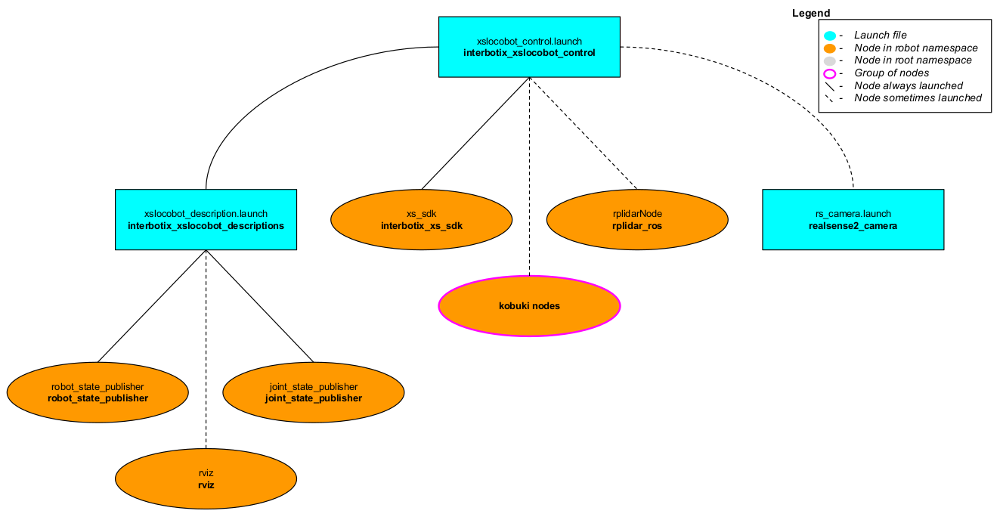

# interbotix_xslocobot_control

## Overview
This package contains the configuration and launch files necessary to easily start the various components of the X-Series Locobot platform. This includes launching the **xs_sdk** node responsible for driving the Dynamixel motors on the robot, loading the URDF to the `robot_description` parameter, starting the Kobuki base, and activating the RealSense D435 camera and RPLidar 2D laser scanner. Essentially, this package is what all 'downstream' ROS packages should reference to get the robot up and running.

## Structure


As shown in the image above, the *interbotix_xslocobot_control* package builds on top of the *interbotix_xslocobot_descriptions* package among many others. To get familiar with the nodes not described below, just hop over to the ROS packages in this repo that launches them.

- **rplidarNode:** responsible for starting the [A2M8 RPlidar](https://www.slamtec.com/en/Lidar/A2) sensor and publishing [LaserScan](http://docs.ros.org/melodic/api/sensor_msgs/html/msg/LaserScan.html) messages on the `/<robot_name>/scan` topic. See the [RPLidar ROS Wiki](http://wiki.ros.org/rplidar) for parameter descriptions. All parameters were left at their default values except for the following:
  - *frame_id:* `/<robot_name>/laser_frame_link`
  - *serial_port:* `/dev/rplidar`
  - *angle_compensate:* `true`

- **kobuki nodes:** a group of three nodes responsible for starting the Kobuki base. See the [Kobuki ROS Wiki](ros.org/kobuki_node) for parameter descriptions. All parameters were left at their default values except for the following:
  - *odom frame:* `/<robot_name>/odom`
  - *base_frame:* `/<robot_name>/base_footprint`
  - *acceleration_limiter:* `true`

- **rs_rgbd.launch:** launches four nodes to run the [RealSense D435](https://www.intelrealsense.com/depth-camera-d435/) camera and publish a variety of image topics. Note that the `base_link` frame of the camera is in the depth frame and is called `/<robot_name>/camera_link`. See the [realsense_ros](https://github.com/IntelRealSense/realsense-ros) repository for parameter descriptions. All parameters were left at their default values except for the following:
  - *tf_prefix:* `/<robot_name>/camera`
  - *enable_infra1:* `true`
  - *enable_infra2:* `true`

As shown in the image above, the *interbotix_xslocobot_control* package builds on top of the [interbotix_xslocobot_descriptions](../interbotix_xslocobot_descriptions) and [interbotix_xs_sdk](https://github.com/Interbotix/interbotix_ros_core/tree/main/interbotix_ros_xseries/interbotix_xs_sdk) packages. Please take a look at those packages to get familiar with their nodes. You will also notice a [config](config/) directory containing many YAML files. Each file (beside the modes.yaml one) specifies the names and initial register values for all the motors that make up a specfic locobot. There is also some 'meta-info' like names of joint groups, the desired joint-topic name and publishing frequency, etc... For a full explanation of each of these parameters, check out the Motor Config file [template](https://github.com/Interbotix/interbotix_ros_core/blob/main/interbotix_ros_xseries/interbotix_xs_sdk/config/motor_configs_template.yaml). The other file located in that directory is the Mode Config one (a.k.a mode.yaml). The parameters in there define the desired operating modes for either a group of joints or single joints, and whether or not they should be torqued on/off at node startup. See more by referencing the Mode Config file [template](https://github.com/Interbotix/interbotix_ros_core/blob/main/interbotix_ros_xseries/interbotix_xs_sdk/config/mode_configs_template.yaml). Typically, the Motor Config file is only defined here while the Mode Config file is also defined in any 'downstream' ROS package. This makes it easy for users to configure their desired motor operating modes depending on their project.

## Usage
To run this package on the physical robot, type the line below in a terminal (assuming the `locobot_wx200` is being launched with the onboard lidar and camera).
```
roslaunch interbotix_xslocobot_control xslocobot_control.launch robot_model:=locobot_wx200 use_base:=true use_lidar:=true use_camera:=true
```

If you are working from a remote computer and would like to visualize the robot using Rviz, open a terminal on your remote and type...
```
roslaunch interbotix_xslocobot_descriptions remote_view.launch robot_name:=locobot_wx200
```
Note that in order for this to work, you must first run the remote installation bash script on your remote computer.

To further customize the launch file at run-time, refer to the table below.

| Argument | Description | Default Value |
| -------- | ----------- | :-----------: |
| robot_model | model type of the Interbotix Locobot such as 'locobot_base' or 'locobot_wx250s' | "" |
| robot_name | name of the robot (could be anything but defaults to 'locobot') | "locobot" |
| show_gripper_bar | if true, the gripper_bar link is included in the 'robot_description' parameter; if false, the gripper_bar and finger links are not loaded to the parameter server. Set to false if you have a custom gripper attachment | true |
| show_gripper_fingers | if true, the gripper fingers are included in the 'robot_description' parameter; if false, the gripper finger links are not loaded to the parameter server. Set to false if you have custom gripper fingers | true |
| external_urdf_loc | the file path to the custom urdf.xacro file that you would like to include in the Interbotix robot's urdf.xacro file| "" |
| use_rviz | launches Rviz; if you are SSH'd into the robot, DON'T set this to true | false |
| rviz_frame | fixed frame in Rviz; this should be changed to `map` or `<robot_name>/odom` if mapping or using local odometry respectively | $(arg robot_name)/base_footprint |
| use_base | if true, the Kobuki ROS nodes are launched | false |
| use_lidar | if true, the RPLidar node is launched | false |
| show_lidar | set to true if the lidar is installed on the robot; this will load the lidar related links to the 'robot_description' parameter | $(arg use_lidar) |
| use_camera | if true, the RealSense D435 camera nodes are launched | false |
| filters | types of RealSense camera filters to use (in this case, the 'pointcloud' filter is needed) | pointcloud |
| align_depth | whether to publish topics with the depth stream aligned with the color stream | false |
| color_fps | frame rate of the color images taken on the RealSense camera| 30 |
| depth_fps | frame rate of the depth images taken on the RealSense camera| 30 |
| color_width | horizontal resolution of the color images taken on the RealSense camera | 640 |
| color_height | vertical resolution of the color images taken on the RealSense camera| 480 |
| motor_configs | the file path to the 'motor config' YAML file | refer to [xslocobot_control.launch](launch/xslocobot_control.launch) |
| mode_configs | the file path to the 'mode config' YAML file | refer to [xslocobot_control.launch](launch/xslocobot_control.launch) |
| load_configs | a boolean that specifies whether or not the initial register values (under the 'motors' heading) in a Motor Config file should be written to the motors; as the values being written are stored in each motor's EEPROM (which means the values are retained even after a power cycle), this can be set to false after the first time using the robot. Setting to false also shortens the node startup time by a few seconds and preserves the life of the EEPROM | true |
