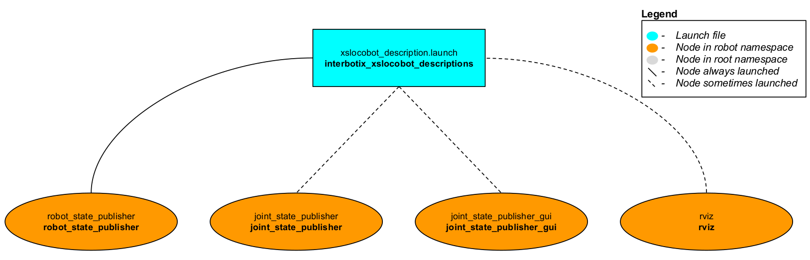
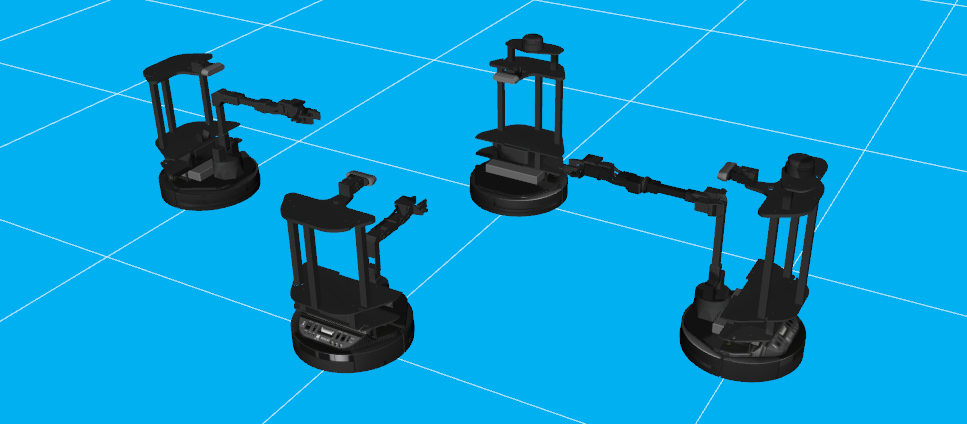

# interbotix_xslocobot_descriptions

## Overview
This package contains the URDFs and meshes for the robots in the Interbotix X-Series Locobot Family. The STL files for each robot are located in a unique folder inside the [meshes](meshes/) directory. Also in the 'meshes' directory is the [interbotix_black.png](meshes/interbotix_black.png) picture. The appearance and texture of the robots come from this picture. Next, the URDFs for the robot are located in the [urdf](urdf/) directory. They are written in 'xacro' format so that users have the ability to customize what parts of the URDF get loaded to the parameter server (see the 'Usage' section below for details). Note that all the other ROS packages in the sub-repo reference this package to launch the robot description.

## Structure

This package contains the [xslocobot_description.launch](launch/xslocobot_description.launch) file responsible for loading parts or all of the robot model. It launches up to four nodes as described below:
- **joint_state_publisher** - responsible for parsing the 'robot_description' parameter to find all non-fixed joints and publish a JointState message with those joints defined.
- **joint_state_publisher_gui** - does the same thing as the 'joint_state_publisher' node but with a GUI that allows a user to easily manipulate the joints.
- **robot_state_publisher** - uses the URDF specified by the parameter robot_description and the joint positions from the joint_states topic to calculate the forward kinematics of the robot and publish the results via tf.
- **rviz** - displays the virtual robot model using the transforms in the 'tf' topic.

## Usage
To run this package, type the line below in a terminal. Note that the `robot_model` argument must be specified as the name of one of the four locobot models. For example, to launch a Locobot with a WidowX 200 arm, type:
```
$ roslaunch interbotix_xslocobot_descriptions xslocobot_description.launch robot_model:=locobot_wx200 use_joint_pub_gui:=true
```
This is the bare minimum needed to get up and running. Take a look at the table below to see how to further customize with other launch file arguments.

| Argument | Description | Default Value |
| -------- | ----------- | :-----------: |
| robot_model | model type of the Interbotix Locobot such as 'locobot_base' or 'locobot_wx250s' | "" |
| robot_name | name of the robot (could be anything but defaults to 'locobot') | "locobot" |
| arm_model | the Interbotix Arm model on the locobot; this should never be set manually but rather left to its default value | refer to [xslocobot_description.launch](launch/xslocobot_description.launch) |
| show_lidar | if true, the lidar is included in the 'robot_description' parameter; only set to true if you purchased a lidar with your locobot | false |
| show_gripper_bar | if true, the gripper_bar link is included in the 'robot_description' parameter; if false, the gripper_bar and finger links are not loaded to the parameter server. Set to false if you have a custom gripper attachment | true |
| show_gripper_fingers | if true, the gripper fingers are included in the 'robot_description' parameter; if false, the gripper finger links are not loaded to the parameter server. Set to false if you have custom gripper fingers | true |
| external_urdf_loc | the file path to the custom urdf.xacro file that you would like to include in the Interbotix robot's urdf.xacro file| "" |
| load_gazebo_configs | set this to true if Gazebo is being used; it makes sure to include Gazebo related configs in the 'robot_description' parameter so that the robot models show up black in Gazebo | false |
| use_joint_pub | launches the joint_state_publisher node | false |
| use_joint_pub_gui | launches the joint_state_publisher GUI | false |
| rate | JointState topic publish rate in Hz | 10 |
| source_list | list of joint state topics that should be merged together | "[]" |
| use_rviz | launches Rviz | true |
| rviz_frame | fixed frame in Rviz; this should be changed to `map` or `<robot_name>/odom` if mapping or using local odometry respectively | $(arg robot_name)/base_footprint |
| rvizconfig | file path to the config file Rviz should load | refer to [xslocobot_description.launch](launch/xslocobot_description.launch) |
| model | file path to the robot-specific URDF including arguments to be passed in | refer to [xslocobot_description.launch](launch/xslocobot_description.launch) |

Note that besides for the [xslocobot_description.launch](launch/xslocobot_description.launch) file, there is another file called [many_xslocobots.launch](launch/many_xslocobots.launch) that features the ability to control multiple Locobots in the same ROS session. This is made possible by the fact that each robot is launched in its own unique namespace. To run it, type...
```
roslaunch interbotix_xslocobot_descriptions many_xslocobots.launch
```
A picture similar to the one below should appear!


Also note that there is another launch file called [remote_view.launch](launch/remote_view.launch). This launch file should be run on a networked ROS computer to visualize the robot in Rviz in real time. See more in the Quickstart section.
