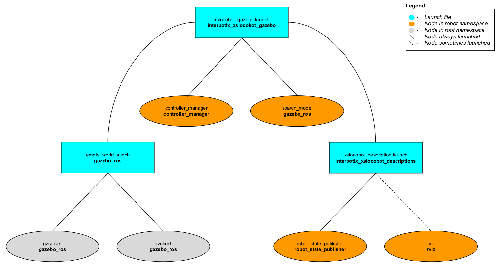

# interbotix_xslocobot_gazebo

## Overview
This package contains the necessary config files to get any rover in our X-Series Interbotix Locobot Family simulated in Gazebo. Specifically, it contains the [locobot_configs.gazebo](config/locobot_configs.gazebo) file which allows the black texture of the robot to display properly (following the method explained [here](http://answers.gazebosim.org/question/16280/how-to-use-custom-textures-on-urdf-models-in-gazebo/)) and starts various plugins. It also contains YAML files with tuned PID gains for the arm, gripper, and pan/tilt joints so that ros_control can control the robot effectively. This package can either be used in conjunction with MoveIt via the FollowJointTrajectory interface or by itself via the JointPositionController interface.

## Structure

As shown above, the *interbotix_xslocobot_gazebo* package builds on top of the *interbotix_xslocobot_descriptions* and *gazebo_ros* packages. To get familiar with the nodes in the *interbotix_xslocobot_descriptions* package, please look at its README. The other nodes are described below:
- **gzserver** - responsible for running the physics update-loop and sensor data generation
- **gzclient** - provides a nice GUI to visualize the robot simulation
- **controller_manager** - responsible for loading and starting a set of controllers at once, as well as automatically stopping and unloading those same controllers
- **spawn_model** - adds the robot model as defined in the 'robot_description' parameter into the Gazebo world

Note that the arm joints can be sent trajectories from MoveIt as they use the [JointTrajectoryController](http://wiki.ros.org/joint_trajectory_controller) ros_control interface or positions using the [JointPositionController](http://wiki.ros.org/ros_control) interface. However, the pan/tilt joints operate via the JointPositionController interface only. To control them, publish position commands directly to the appropriate topics (ex. `/<robot_name>/pan_controller/command` for the 'pan' joint).

## Usage
To run this package, type the line below in a terminal (assuming the **locobot_wx250s** is being launched with the lidar attached and using trajectory controllers for the arm).
```
$ roslaunch interbotix_xslocobot_gazebo xslocobot_gazebo.launch robot_model:=locobot_wx250s show_lidar:=true use_trajectory_controllers:=true
```
Since by default, Gazebo is started in a 'paused' state (this is done to give time for the controllers to kick in), unpause the physics once it is fully loaded by typing:
```
$ rosservice call /gazebo/unpause_physics
```
This is the bare minimum needed to get up and running. Take a look at the table below to see how to further customize with other launch file arguments.

| Argument | Description | Default Value |
| -------- | ----------- | :-----------: |
| robot_model | model type of the Interbotix Locobot such as 'locobot_base' or 'locobot_wx250s' | "" |
| robot_name | name of the robot (could be anything but defaults to 'locobot') | "locobot" |
| arm_model | the Interbotix Arm model on the locobot; this should never be set manually but rather left to its default value | refer to [xslocobot_description.launch](launch/xslocobot_description.launch) |
| show_lidar | if true, the lidar is included in the 'robot_description' parameter; only set to true if you purchased a lidar with your locobot | false |
| show_gripper_bar | if true, the gripper_bar link is included in the 'robot_description' parameter; if false, the gripper_bar and finger links are not loaded to the parameter server. Set to false if you have a custom gripper attachment | true |
| show_gripper_fingers | if true, the gripper fingers are included in the 'robot_description' parameter; if false, the gripper finger links are not loaded to the parameter server. Set to false if you have custom gripper fingers | true |
| external_urdf_loc | the file path to the custom urdf.xacro file that you would like to include in the Interbotix robot's urdf.xacro file| "" |
| use_rviz | launches Rviz; set to false if SSH'd into the physical robot | true |
| rviz_frame | fixed frame in Rviz; this should be changed to `map` or `<robot_name>/odom` if mapping or using local odometry respectively | $(arg robot_name)/base_footprint |
| world_name | the file path to the Gazebo 'world' file to load | refer to [xslocobot_gazebo.launch](launch/xslocobot_gazebo.launch) |
| gui | launch the Gazebo GUI; set to false if SSH'd into the physical robot | true |
| debug | Start gzserver in debug mode using gdb | false |
| paused | start Gazebo in a paused state | true |
| recording | enable Gazebo state log recording | false |
| use_sim_time | tells ROS nodes asking for time to get the Gazebo-published simulation time, published over the ROS topic `/clock` | true |
| use_position_controllers | set to true to have the ability to command arbitrary positions to the arm joints in Gazebo | false |
| use_trajectory_controllers | set to true to have the ability to command joint trajectories to the arm joints in Gazebo | false |
| dof | degrees of freedom of the specified arm (only necessary if *use_position_controllers* is set to true) | 5 |
