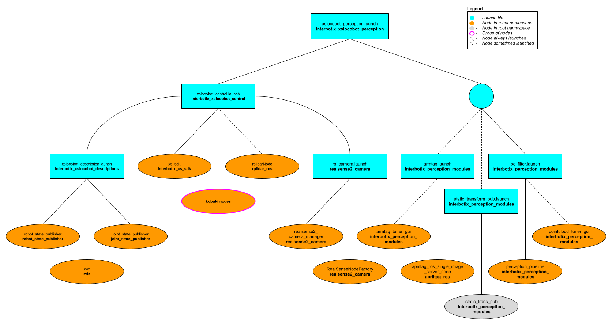
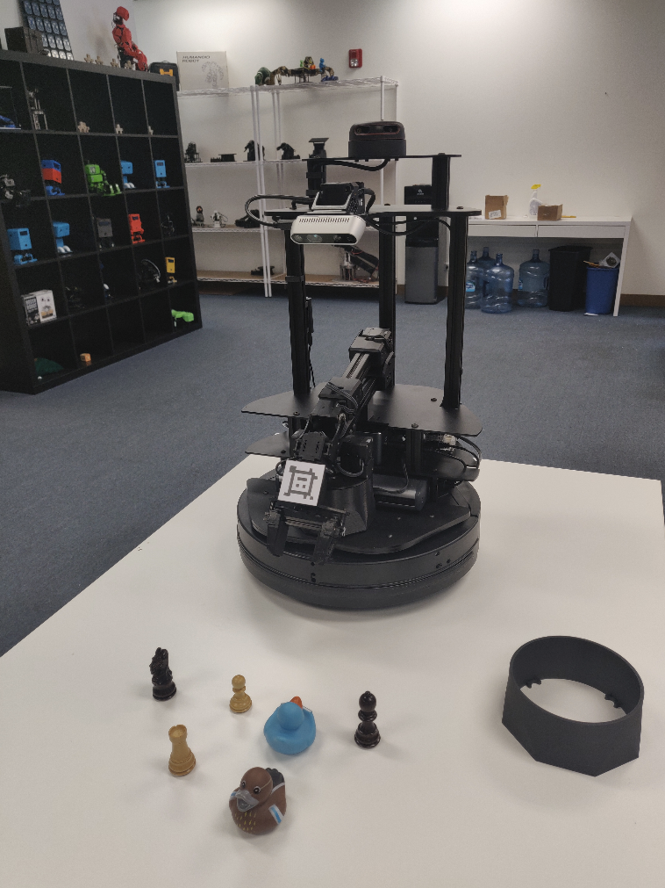
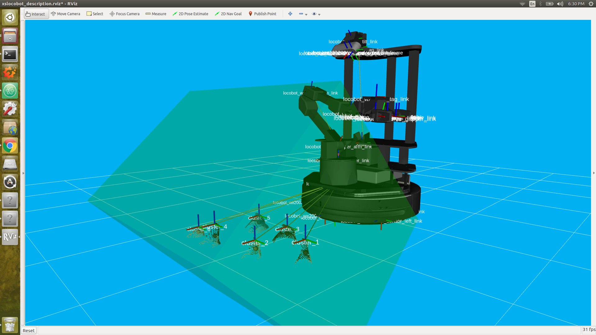

# interbotix_xslocobot_perception

## Overview
This package contains the necessary config and launch files to get any of the Interbotix X-Series Locobot arms working with the [perception pipeline](https://industrial-training-master.readthedocs.io/en/melodic/_source/session5/Building-a-Perception-Pipeline.html). The end result allows for an arm to pick up any small, non-reflective object from a tabletop-type surface that is within a RealSense color/depth camera's field of view. While any Intel RealSense color/depth camera can be used, this package was mainly tested with the [D435](https://www.intelrealsense.com/depth-camera-d435/) camera. See more details on how the pipeline works in the [interbotix_perception_modules](https://github.com/Interbotix/interbotix_ros_toolboxes/tree/main/interbotix_perception_toolbox/interbotix_perception_modules) ROS package.

## Structure

As shown above, this package builds on top of the *interbotix_xslocobot_control* and *interbotix_perception_modules* packages. To get familiar with those packages, please refer to their respective READMEs.

## Usage
To work with this package, place some small, non-reflective objects on the floor near the Kobuki base such that they are clearly visible to the camera (when it's pointed down) and are reachable by the arm. The objects should be small enough such that they can easily fit between the gripper fingers on the robot arm no matter the gripper's orientation. They can not be too reflective though as that will interfere with the depth camera's ability to locate them (as it uses infrared light). Similarly, the workspace should not be in direct sunlight as that also interferes with the camera's depth sensing abilities. Otherwise, the small objects can be arbitrarily placed. For the demo [here](scripts/pick_place_no_armtag.py), you should setup your workspace area as shown below.

<p align="center">
  
</p>

Now with a standalone arm, two things would normally have to be done. First, the camera would need to know where the arm is relative to itself. Second, the pointcloud filter parameters would have to be tuned to 'register' the objects being picked up. However, since the arm and camera in this case are part of the same robot, this transform is already known from the URDF. So there really is no need to use the AR tag on the arm to figure out this transform. The tag is mainly there so that if you decide to remove the arm from the Locobot for some other project, you can still use the perception pipeline.

That said, in case the URDF of the robot platform is not accurate enough for you, the [apriltag_ros](https://github.com/AprilRobotics/apriltag_ros) ROS package can be used to find the transform of the AprilTag on the arm's end-effector (looks like a smiley face :P) relative to the camera's color optical frame. Following this, the transform from the `base_link` frame to the `plate_link` frame can be calculated and published as a static transform such that the `ar_tag_link` frame of the arm matches the position of where the camera thinks the Apriltag is located.

To get that transform, run the following launch command in a terminal (assuming a Locobot WidowX 200 arm is being used)...

```
roslaunch interbotix_xslocobot_perception xslocobot_perception.launch robot_model:=locobot_wx200 use_armtag_tuner_gui:=true use_pointcloud_tuner_gui:=true use_armtag:=true use_static_transform_pub:=true
```

Note that if you don't want to calibrate using the AR tag, then only set the `robot_model` and `use_pointcloud_tuner_gui` parameters. Afterwards, skip to the **PointCloud Filter Tuning** section below.

#### ArmTag Calibration

Rviz should pop up along with two standalone GUIs. One of those GUIs will look like the picture below.

<p align="center">
  
</p>

Depending on how you setup your arm and camera in your workspace, the AprilTag on the arm may not be visible to the camera. To make it visible, first torque off all the arm joints by opening a terminal and typing...

```
rosservice call /locobot/torque_enable "{cmd_type: 'group', name: 'arm', enable: false}"
```

Next, manually manipulate the arm such that the AprilTag is clearly visible to the camera (the live video stream in the bottom left of the Rviz display should help with that). Then in the same terminal as before, torque the arm back on as follows...

```
rosservice call /locobot/torque_enable "{cmd_type: 'group', name: 'arm', enable: true}"
```

Now, in the Armtag Tuner GUI, click the 'Snap Pose' button. Feel free to toggle up/down the number of snapshots that should be taken. The poses calculated from the snapshots will then be averaged to come up with a more accurate pose of where the arm is relative to the camera. One way to check the accuracy of the calculated pose is to toggle the `RawPointCloud` display in Rviz. Hopefully, the pointcloud version of the AprilTag should be located on (possibly a couple millimeters below) the AR tag link of the virtual robot model. If it's not, feel free to keep pressing the 'Snap Pose' button until it looks alright. As an FYI, from experience, it seems the camera thinks the arm should really be 2-3 mm offset along the `plate_link`'s X and Y axes. However, this could just be due to how the Apriltag is placed on the arm. It also thinks the `plate_link` should be offset upwards on its Z axis by just over 4 mm.

#### PointCloud Filter Tuning

At this point, you should see a pointcloud version of your tabletop with the objects on it. If your arm is in the way, just torque it off and move it to its Sleep pose (make sure to hold the arm before torquing it off). Then, using the PointCloud Tuner GUI, tune the pointcloud parameters for your specific use case. A detailed explanation of how to go about doing this can be found [here](https://github.com/Interbotix/interbotix_ros_toolboxes/tree/main/interbotix_perception_toolbox/interbotix_perception_modules). Don't forget to save your configs after tuning them!

Now, you are almost ready to run the [python demo](scripts/pick_place_no_armtag.py) script. First make sure to edit the robot model name in the script to your robot model (if it's not 'locobot_wx200'). Second, open a terminal and type...

```
rosparam set /locobot/use_perception true
```

The above command sets the `use_perception` ROS parameter so that when you run the python script, it knows to include an instance of the InterbotixPointCloudInterface module as part of the Locobot. Finally, navigate to the [pick_place_no_armtag.py](scripts/pick_place_no_armtag.py) script and execute it.

While running the script, you should see a TF marker appear close to the top of each object's cluster (see the image below for clarification). This is where the camera believes the top of each cluster to be, and is the position returned to the user from the `get_cluster_positions` function. These TFs are temporary and will fade from Rviz after a minute is up. The arm will then line up its `ee_gripper_link` to be in the same spot as each of these cluster positions and hopefully pick up the objects.



After running the demo, `Ctrl-C` from the launch file. The `base_link` to `plate_link` transform will automatically be saved in a file called 'static_transforms.yaml' in the [config](config/) directory (if you decided to go through the AR tag calibration). Now, you can run the demo script headless - first by typing...

```
roslaunch interbotix_xslocobot_perception xslocobot_perception.launch robot_model:=locobot_wx200 use_rviz:=false use_static_transform_pub:=true
```

...then heading over to the [scripts](scripts/) directory and running the [pick_place_no_armtag.py](scripts/pick_place_no_armtag.py) script. Note that you can leave the `use_static_transform_pub` argument above to its default value ('false') if you did not do the AR tag calibration

For more info, check out the [Armtag](https://github.com/Interbotix/interbotix_ros_toolboxes/tree/main/interbotix_perception_toolbox/interbotix_perception_modules/src/interbotix_perception_modules/armtag.py) or [Pointcloud](https://github.com/Interbotix/interbotix_ros_toolboxes/tree/main/interbotix_perception_toolbox/interbotix_perception_modules/src/interbotix_perception_modules/pointcloud.py) Python APIs to reference the fully documented functions.

Other launch file arguments for further customization can be seen below...

| Argument | Description | Default Value |
| -------- | ----------- | :-----------: |
| robot_model | model type of the Interbotix Locobot such as 'locobot_px100' or 'locobot_wx250s' | "" |
| robot_name | name of the robot (could be anything but defaults to 'locobot') | "locobot" |
| external_urdf_loc | the file path to the custom urdf.xacro file that you would like to include in the Interbotix robot's urdf.xacro file| "" |
| use_rviz | launches Rviz; if you are SSH'd into the robot, DON'T set this to true | false |
| rviz_frame | fixed frame in Rviz; this should be changed to `map` or `<robot_name>/odom` if mapping or using local odometry respectively | $(arg robot_name)/base_footprint |
| load_configs | a boolean that specifies whether or not the initial register values (under the 'motors' heading) in a Motor Config file should be written to the motors; as the values being written are stored in each motor's EEPROM (which means the values are retained even after a power cycle), this can be set to false after the first time using the robot. Setting to false also shortens the node startup time by a few seconds and preserves the life of the EEPROM | true |
| filters | types of RealSense camera filters to use (in this case, the 'pointcloud' filter is needed) | pointcloud |
| color_fps | frame rate of the color images taken on the RealSense camera| 30 |
| depth_fps | frame rate of the depth images taken on the RealSense camera| 30 |
| color_width | horizontal resolution of the color images taken on the RealSense camera | 640 |
| color_height | vertical resolution of the color images taken on the RealSense camera| 480 |
| launch_driver | true if the *xslocobot_control.launch* file should be launched - set to false if you would like to run your own version of this file separately | true |
| filter_ns | name-space where the pointcloud related nodes and parameters are located | $(arg robot_name)/pc_filter |
| filter_params | file location of the parameters used to tune the perception pipeline filters | refer to [xslocobot_perception.launch](launch/xslocobot_perception.launch) |
| use_pointcloud_tuner_gui | whether to show a GUI that a user can use to tune filter parameters | false |
| enable_pipeline | whether to enable the perception pipeline filters to run continuously; to save computer processing power, this should be set to False unless you are actively trying to tune the filter parameters; if False, the pipeline will only run if the `get_cluster_positions` ROS service is called | $(arg use_pointcloud_tuner_gui) |
| cloud_topic | the absolute ROS topic name to subscribe to raw pointcloud data | /$(arg robot_name)/camera/depth/color/points |
| use_armtag | whether or not to use the AprilTag on the arm to get the camera to arm pose; it's not really necessary since this is already defined in the URDF; but using the AprilTag *may* give more accurate results | false |
| tag_id | id of the AprilTag being used | 5 |
| tag_size | size [m] of the AprilTag (as defined from one inside-corner to the opposite inside corner) | 0.02 |
| tag_family | family to which the AprilTag belongs | tagStandard41h12 |
| standalone_tags | individual AprilTags the algorithm should be looking for; this should not be user-set unless using multiple unique tags | refer to [xslocobot_perception.launch](launch/xslocobot_perception.launch) |
| camera_frame | the camera frame in which the AprilTag will be detected | $(arg robot_name)/camera_color_optical_frame |
| apriltag_ns | name-space where the AprilTag related nodes and parameters are located | $(arg robot_name)/apriltag |
| camera_color_topic | the absolute ROS topic name to subscribe to color images | $(arg robot_name)/camera/color/image_raw |
| camera_info_topic | the absolute ROS topic name to subscribe to the camera color info | $(arg robot_name)/camera/color/camera_info |
| armtag_ns | name-space where the Armtag related nodes and parameters are located | $(arg robot_name)/armtag |
| ref_frame | the reference frame that the armtag node should use when publishing a static transform for where the arm is relative to the camera | $(arg robot_name)/base_link |
| arm_base_frame | the child frame that the armtag node should use when publishing a static transform for where the arm is relative to the camera | $(arg robot_name)/plate_link |
| arm_tag_frame | name of the frame on the arm where the AprilTag is located (defined in the URDF usually) | $(arg robot_name)/ar_tag_link |
| use_armtag_tuner_gui | whether to show a GUI that a user can use to publish the 'ref_frame' to 'arm_base_frame' transform | false |
| position_only | whether only the position component of the detected AprilTag pose should be used when calculating the 'ref_frame' to 'arm_base_frame' transform; this should only be set to true if a tf chain already exists connecting the camera and arm base_link frame, and you just want to use the AprilTag to refine the pose further | true |
| use_static_transform_pub | this should be set to true if using the AprilTag on the arm, or if you'd like to load the 'ref_frame' to 'arm_base_frame' transform from the static_transforms.yaml file | false |
| load_transforms | whether or not the **static_trans_pub** node should publish any poses stored in the static_transforms.yaml file at startup; this should only be set to false if a tf chain already exists connecting the camera and arm base_link frame (usually defined in a URDF), and you'd rather use that tf chain as opposed to the one specified in the static_transforms.yaml file | true |
| transform_filepath | filepath to the static_transforms.yaml file used by the **static_trans_pub** node; if the file does not exist yet, this is where you'd like the file to be generated | refer to [xslocobot_perception.launch](launch/xslocobot_perception.launch) |

## Troubleshooting

For troubleshooting tips, look at the guide [here](https://github.com/Interbotix/interbotix_ros_toolboxes/tree/main/interbotix_perception_toolbox/interbotix_perception_modules/README.md#Troubleshooting).
