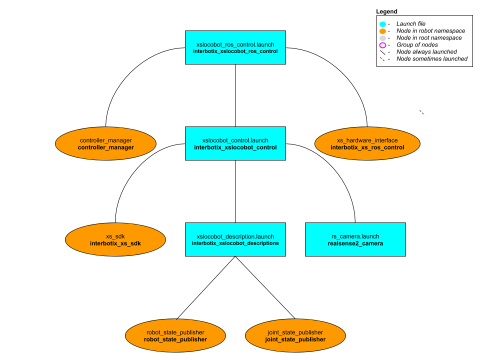

# interbotix_xslocobot_ros_control

## Overview
This package provides the necessary ROS controllers needed to get MoveIt to control any physical arm on an X-Series Locobot. It essentially takes in Joint Trajectory commands from MoveIt (via the FollowJointTrajectoryAction interface) and then publishes joint commands at the right time to the **xs_sdk** node. Currently, only the 'position' values in the Joint Trajectory messages are used since that provides the smoothest motion. Note that while this package is really only meant to be used with MoveIt, it could technically be used with any other node that can interface properly with the [joint_trajectory_controller](http://wiki.ros.org/joint_trajectory_controller) package.

## Structure

As explained in the Overview, this package builds on top of the *interbotix_xslocobot_control* package (which starts the **xs_sdk** node), and is typically used in conjunction with the *interbotix_xslocobot_moveit* package. To get familiar with the nodes in those packages, feel free to look at their READMEs. The other nodes are described below:
- **controller_manager** - responsible for loading and starting a set of controllers at once, as well as automatically stopping and unloading those same controllers
- **xs_hardware_interface** - receives joint commands from the ROS controllers and publishes them to the correct topics (subscribed to by the **xs_sdk** node) at the appropiate times

## Usage
This package is not meant to be used by itself but included in a launch file within your custom ROS package (which should expose a FollowJointTrajectoryAction interface).
To run this package, type the line below in a terminal (assuming a Locobot with a PincherX 100 is being launched).
```
$ roslaunch interbotix_xslocobot_ros_control xslocobot_ros_control.launch robot_model:=px100
```
This is the bare minimum needed to get up and running. Take a look at the table below to see how to further customize with other launch file arguments.

| Argument | Description | Default Value |
| -------- | ----------- | :-----------: |
| robot_model | model type of the Interbotix Locobot such as 'locobot_base' or 'locobot_wx250s' | "" |
| robot_name | name of the robot (could be anything but defaults to 'locobot') | "locobot" |
| show_lidar | set to true if the lidar is installed on the robot; this will load the lidar related links to the 'robot_description' parameter | $(arg use_lidar) |
| external_urdf_loc | the file path to the custom urdf.xacro file that you would like to include in the Interbotix robot's urdf.xacro file| "" |
| use_rviz | launches Rviz | false |
| use_camera | if true, the RealSense D435 camera nodes are launched | false |
| mode_configs | the file path to the 'mode config' YAML file | refer to [xslocobot_ros_control.launch](launch/xslocobot_ros_control.launch) |
| dof | the degrees of freedom of the arm | 5 |
